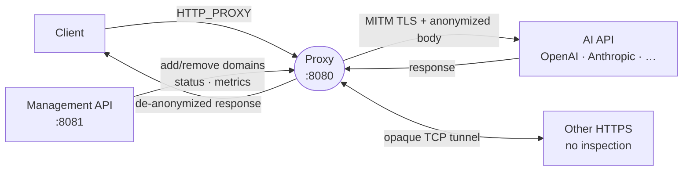
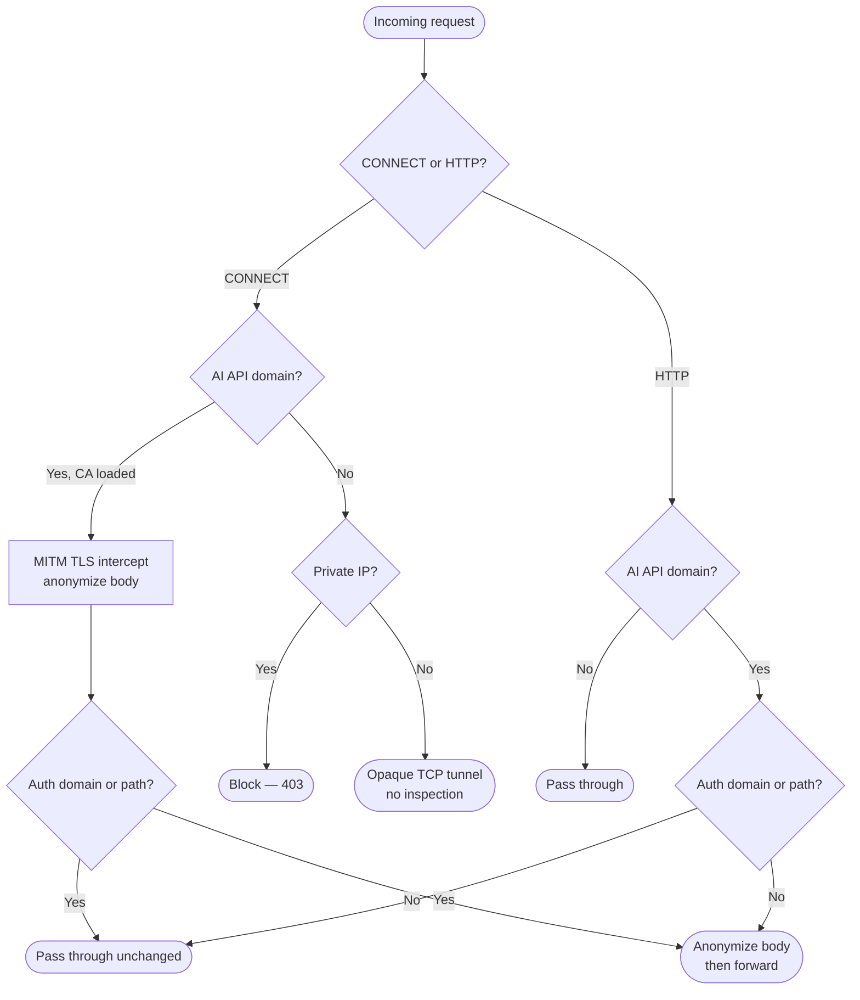

# AI Anonymizing Proxy

Privacy-preserving infrastructure for AI-assisted development.

AI tooling is evolving rapidly, but data protection frameworks — particularly GDPR in Europe —
set a high bar for what can leave your environment. This project started from a belief that you
should not have to choose between the quality of your AI tools and the privacy of your data.

The proxy sits transparently between your AI clients and upstream APIs — Claude Code, Cursor,
VS Code extensions, or anything that speaks HTTP — anonymizing personally identifiable
information before it leaves your machine and restoring it in responses, without compromising
the quality of the interaction.

It is a local proxy, not a cloud service. Your data does not pass through any intermediary
beyond your own machine.

Written in Go. Early alpha, single-instance, actively developed.

This is an earnest attempt to make AI tooling safer by default. The goal is to grow it into a
mature infrastructure component with the help of the community. Contributions, ideas, and
feedback are welcome.

---

An HTTP/HTTPS forward proxy that intercepts requests to AI API providers and strips personally
identifiable information (PII) from request bodies before forwarding them. Sits between your
applications and AI APIs (OpenAI, Anthropic, Cohere, Mistral, etc.) to prevent sensitive data
from leaking into LLM prompts.

Supports **MITM TLS termination** for HTTPS traffic — the proxy decrypts, anonymizes, and
re-encrypts requests to AI API domains using a local CA certificate. Non-AI traffic is tunneled
transparently.

## How It Works



**Traffic routing — how the proxy decides what to do with each request:**



**PII detection runs in two stages:**

1. **Regex pass** — fast, deterministic patterns for emails, phone numbers, SSNs, credit cards,
   IP addresses, API keys, street addresses, ZIP codes. Each pattern carries a confidence score.
2. **Ollama AI pass** (async best-effort) — context-aware detection for names, job titles,
   medical info, salaries, company names. On cache miss the regex-only result is returned
   immediately while Ollama runs in the background; on the next identical request the cached AI
   detections are applied.

Detected PII is replaced with deterministic anonymized tokens (e.g. `user<hash>@example.com`),
so the same input always produces the same output. Tokens are reversed in the response so the AI
API's reply reaches the client with original values restored.

## Prerequisites

- **Go 1.24+** — [go.dev/dl](https://go.dev/dl/)
- **Ollama** (optional, for AI-powered PII detection) — [ollama.com](https://ollama.com)

If Ollama is not running, the proxy falls back to regex-only detection.

## Quick Start

```bash
make build
./bin/proxy
```

The proxy listens on `127.0.0.1:8080` (proxy) and `127.0.0.1:8081` (management API). On first
run it auto-generates `ca-cert.pem` and `ca-key.pem` in the working directory.

Point clients at `http://localhost:8080` and trust `ca-cert.pem` for HTTPS interception.
See [docs/client-setup.md](docs/client-setup.md) for per-tool instructions.

## Documentation

| Topic | File |
| ----- | ---- |
| Architecture and design | [docs/architecture.md](docs/architecture.md) |
| Configuration reference (env vars, proxy-config.json, upstream proxy) | [docs/configuration.md](docs/configuration.md) |
| Installing as a service (launchd, systemd, Windows) + log rotation | [docs/installation.md](docs/installation.md) |
| HTTPS/MITM TLS interception and CA trust setup | [docs/tls-mitm.md](docs/tls-mitm.md) |
| Configuring clients (shell, VSCode, Git, Python, Node.js) | [docs/client-setup.md](docs/client-setup.md) |
| Management API reference | [docs/management-api.md](docs/management-api.md) |
| Building, linting, testing, CI/CD | [docs/development.md](docs/development.md) |

## Monitoring

**macOS:**

```bash
tail -f /opt/ai-proxy/logs/proxy.err.log
launchctl list | grep ai-proxy
```

**Linux:**

```bash
journalctl -u ai-proxy -f
systemctl status ai-proxy
```

**Windows:**

```powershell
Get-Content C:\ai-proxy\logs\proxy.err.log -Wait
nssm status ai-proxy
```

**Runtime metrics** (JSON):

```bash
curl http://localhost:8081/metrics
```

## Security

- **SSRF protection.** CONNECT tunnels and plain-HTTP forwarding block destinations that resolve
  to private/loopback/link-local IP ranges (`10.0.0.0/8`, `172.16.0.0/12`, `192.168.0.0/16`,
  `127.0.0.0/8`, `169.254.0.0/16`, `::1/128`, `fc00::/7`, `fe80::/10`). IP addresses are
  checked at TCP connection time, not DNS resolution time, to prevent DNS rebinding attacks.
- **Isolated outbound transport.** The proxy transport never reads `HTTP_PROXY` / `HTTPS_PROXY`
  from the environment; upstream proxy chaining is configured explicitly via `UPSTREAM_PROXY`.
- **Request body limits.** Anonymization reads at most 50 MB per request body. Ollama response
  reads are capped at 10 MB.
- **Error sanitization.** Upstream errors are logged server-side but never exposed to clients
  (all proxy error responses return generic messages).
- **Management API.** Binds to `127.0.0.1` only. Optionally protected by bearer token auth via
  `MANAGEMENT_TOKEN`.

## Known Limitations

- **Clients must trust the proxy CA.** HTTPS interception only works if the client trusts the
  proxy's CA certificate. Without it, clients will see TLS certificate errors.
- **Ollama detection cache is in-memory with no eviction.** The cache grows unboundedly until the
  proxy is restarted. The cert cache is capped at 10 000 entries and is cleared in full when the
  limit is reached.
- **Streaming responses use on-the-fly de-anonymization.** SSE / chunked responses are never
  fully buffered; a sliding window approach replaces tokens as data flows through, with a 64-byte
  overlap to prevent tokens from straddling chunk boundaries.
- **Management API authentication is optional.** Set `MANAGEMENT_TOKEN` to require bearer token
  auth. Without it, anyone with network access to port 8081 can add or remove domains.

## License

MIT
