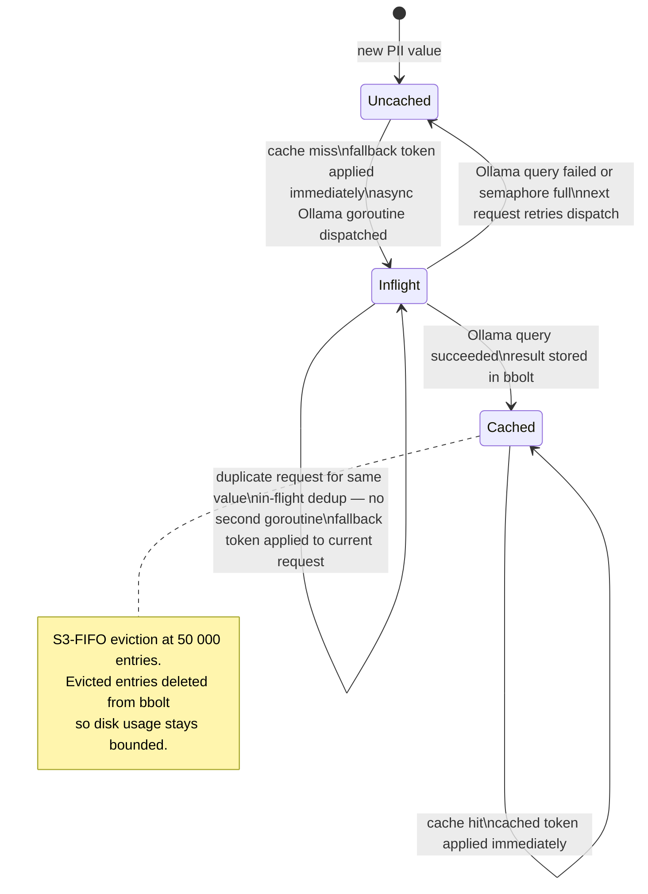
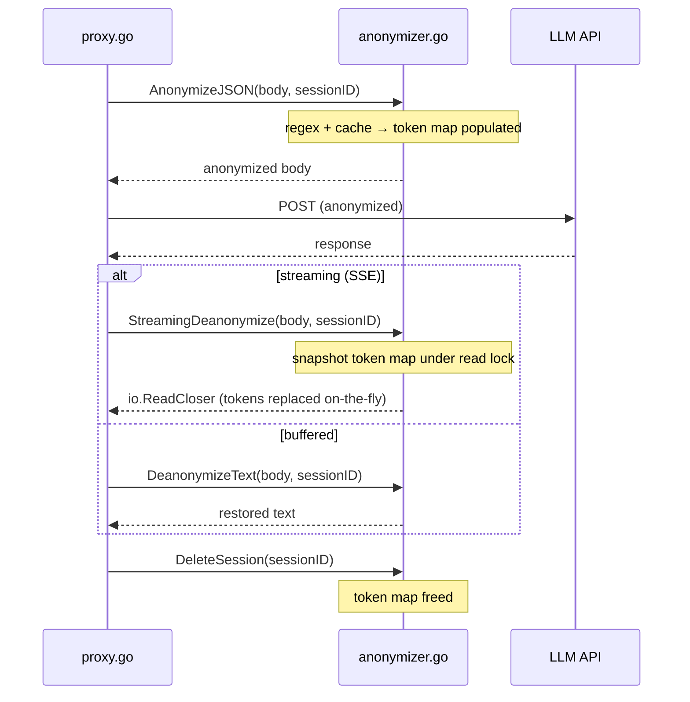

# Anonymization Pipeline

This document describes how the proxy detects, replaces, and later reverses PII in requests and
responses: the two-stage detection pipeline, token format, session lifecycle, Ollama async cache,
and the streaming deanonymization strategy.

## Overview

```
Request body
    │
    ├─ 1. Regex pass          fast, structured patterns, per-pattern confidence
    │       │
    │       └─ low confidence ─► 2. Ollama cache lookup  (async, never blocks request)
    │
    ├─ 3. Session map write   token → original, ephemeral, deleted after response
    │
    └─► Anonymized body sent to LLM API

Response body
    │
    ├─ 4. Session map lookup  token → original (streaming or buffered)
    │
    └─► Restored body returned to client
```

The Ollama sidecar is **never on the critical path**. It populates a persistent cache
asynchronously; the request is always returned immediately with whatever tokens are available.

---

## Stage 1 — Regex detection

Eight compiled patterns cover the most common structured PII types. Each carries a confidence
score that reflects its false-positive risk:

| PII type       | Token prefix    | Example match              | Confidence |
|----------------|-----------------|----------------------------|------------|
| Email          | `EMAIL`         | `user@example.com`         | 0.95       |
| API key        | `APIKEY`        | `Bearer sk-abc…` (≥20 ch)  | 0.90       |
| SSN            | `SSN`           | `123-45-6789`              | 0.85       |
| Credit card    | `CREDITCARD`    | `4111 1111 1111 1111`      | 0.85       |
| IPv6 address   | `IPADDRESS`     | `::1`, `2001:db8::1`       | 0.85       |
| Street address | `ADDRESS`       | `123 Main Street`          | 0.75       |
| IPv4 address   | `IPADDRESS`     | `192.168.1.1`              | 0.70       |
| Phone number   | `PHONE`         | `+1-555-123-4567`          | 0.65       |
| ZIP code       | `ADDRESS`       | `90210`                    | 0.40       |

If a match's confidence is **at or above** `aiConfidenceThreshold` (default `0.80`), the token
is applied immediately. If it falls below the threshold, Stage 2 runs.

---

## Stage 2 — Ollama async cache

For low-confidence matches the proxy consults a persistent per-value cache keyed by the original
PII string. The cache is populated by background Ollama goroutines that run outside the request
cycle.



**Key properties:**

- A cache miss **never leaves PII unmasked** — the fallback token is applied immediately and the
  miss is logged.
- The in-flight deduplication map prevents multiple goroutines querying Ollama for the same
  value concurrently.
- The Ollama semaphore (`ollamaMaxConcurrent`, default 1) caps concurrent queries; excess
  goroutines are dropped and retried on the next request.

---

## Token format

All tokens use the format:

```
[PII_<TYPE>_<8hex>]
```

For example: `[PII_EMAIL_c160f8cc]`, `[PII_PHONE_7f4e1b02]`, `[PII_IPADDRESS_5d8c3f1a]`.

- `<TYPE>` is the uppercased PII type name, giving the LLM semantic context without revealing the
  original value.
- `<8hex>` is the first 8 hex characters of `md5(original_value)` — deterministic, so the same
  value always produces the same token within and across sessions.
- The bracket notation is chosen to satisfy the **non-retriggering invariant**: no token matches
  any of the eight compiled regex patterns. A violation here would cause the proxy to tokenize
  its own output in future sessions ("proxy eats itself"). `TestTokenFormatNonRetriggering`
  enforces this property on every CI run.

A system instruction is injected into every anonymized request instructing the LLM to reproduce
tokens exactly as written. The type label in the token gives the model enough context to reason
correctly about the surrounding sentence structure.

---

## Session map lifecycle

Each request receives a unique `sessionID` (random UUID). The token → original mapping is stored
in `anonymizer.sessions[sessionID]` and deleted immediately after the response is delivered.



The token map snapshot in `StreamingDeanonymize` is taken under a read lock before the goroutine
starts, so a `DeleteSession` call that races with streaming cannot cause missed replacements.

---

## Streaming deanonymization

The Anthropic API delivers one or two characters per `text_delta` SSE event, meaning a single
token like `[PII_EMAIL_c160f8cc]` frequently arrives split across multiple events:

```
{"type":"text_delta","text":"[PII_EMA"}
{"type":"text_delta","text":"IL_c160f8cc]"}
```

Raw byte replacement cannot match tokens split this way. `StreamingDeanonymize` handles this by:

1. Buffering incoming bytes line by line.
2. Parsing each `data: {...}` SSE line as JSON.
3. Accumulating text content across consecutive `content_block_delta` / `text_delta` **and**
   `thinking_delta` events.
4. Flushing only the prefix that cannot be the start of a pending token. A `tokenSuffixLen` of
   26 bytes is retained in the accumulator — enough to cover the longest possible token
   (`[PII_CREDITCARD_XXXXXXXX]` = 25 chars).
5. Applying the replacer to **all** passthrough paths (non-JSON lines, non-delta events, etc.)
   so tokens embedded anywhere in the SSE stream are deanonymized.

---

## Persistent cache — bbolt + S3-FIFO

The Ollama value cache uses a two-layer design:

| Layer     | Implementation     | Purpose                                              |
|-----------|--------------------|------------------------------------------------------|
| Hot layer | S3-FIFO (memory)   | Serves cache hits in nanoseconds; bounded capacity   |
| Cold layer| bbolt (disk)       | Survives process restarts; source of truth           |

**S3-FIFO** (Yang et al., 2023) uses two FIFO queues — S (10% of capacity, probationary) and
M (90%, protected) — plus a ghost set that tracks recently evicted S keys. A new key enters S;
if accessed while in S it is promoted to M on eviction; if it was in the ghost set it goes
directly to M. This makes the cache scan-resistant without LRU's lock contention.

On eviction from either queue, the entry is also deleted from bbolt, keeping disk usage bounded
to approximately `cacheCapacity` entries (default 50 000).

On a cold read (memory miss, bbolt hit), the entry is re-warmed into the S3-FIFO layer.

---

## Observability

### Logs

Every low-confidence cache miss emits a structured log line:

```
[ANONYMIZER] low-confidence cache miss piiType=phone
```

This is the primary signal that a value is on the weak path. A steady stream of misses for a
given type means either Ollama has not yet warmed the cache for those values (expected at cold
start) or the values change frequently enough that cache entries expire before reuse.

Ollama dispatch outcomes are also logged:

```
[ANONYMIZER] Ollama busy, skipping background query for value
[ANONYMIZER] async Ollama query failed: <error>
[ANONYMIZER] async Ollama cache populated for N value(s)
```

### Metrics (`GET /metrics` → `piiTokens`)

All anonymizer counters are exposed under the `piiTokens` key in the management API metrics
endpoint. They reset on proxy restart.

| Field | Description |
|-------|-------------|
| `replaced` | Total PII tokens inserted across all requests |
| `deanonymized` | Total tokens reversed in responses |
| `cacheHits` | Per-PIIType count of low-confidence matches served from cache. Only types with at least one hit appear. |
| `cacheMisses` | Per-PIIType count of low-confidence cache misses. Each miss also increments `cacheFallbacks`. |
| `ollamaDispatches` | Background Ollama goroutines dispatched (counted before the goroutine starts) |
| `ollamaErrors` | Ollama queries that failed — includes both semaphore-full drops and HTTP/parse errors |
| `cacheFallbacks` | Times a deterministic fallback token was applied on a low-confidence miss |

**Reading cache effectiveness:** `cacheFallbacks / ollamaDispatches` trending toward 0 after
warm-up means the cache is working — recurring values get hits and Ollama is no longer needed
for them. A ratio near 1 after warm-up indicates either Ollama is unreachable, values are
high-cardinality (each occurrence is unique), or `aiConfidenceThreshold` is set too low and is
routing too many patterns through the cache path.

**Per-type breakdown** lets you identify which PII categories generate the most cache pressure.
High miss rates for `phone` or `ipAddress` (lower-confidence patterns) are expected; high miss
rates for `ssn` or `creditCard` (higher-confidence patterns) suggest those patterns are being
triggered by non-PII data and worth investigating with `LOG_LEVEL=debug`.

---

## GDPR notes

- PII values are stored in the bbolt cache **only for low-confidence Ollama detections**. Values
  anonymized by the high-confidence regex path do not touch the cache.
- Token → original session maps are in-process memory only and are deleted after each request.
- Setting `USE_AI_DETECTION=false` disables the Ollama path entirely; the bbolt cache is never
  written to.
- The bbolt file path is configured via `CACHE_PATH` (or `cachePath` in `proxy-config.json`). If
  not set, an in-memory cache is used — no PII values persist to disk at all.
