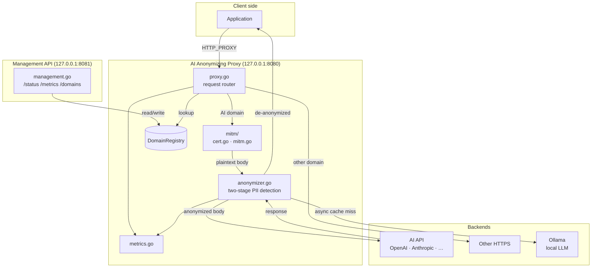
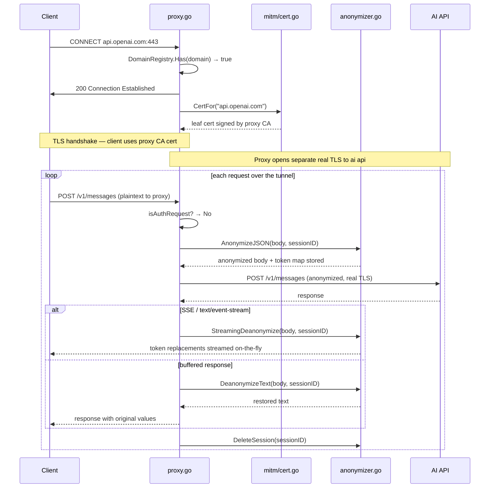
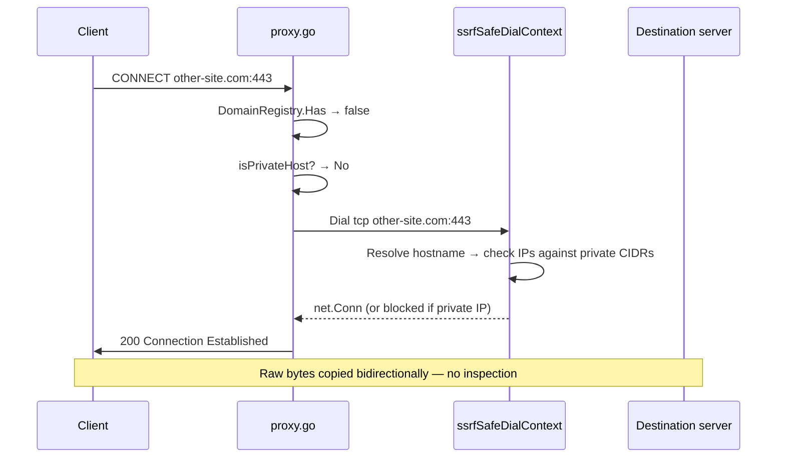
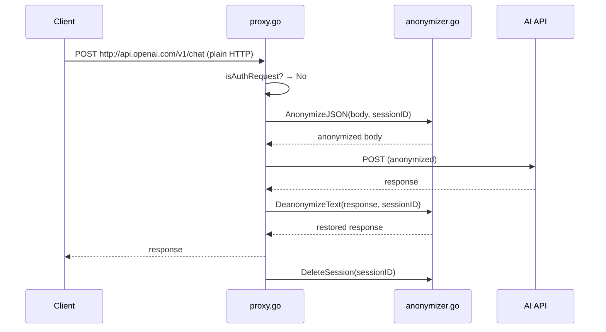
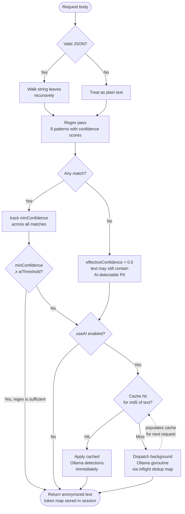
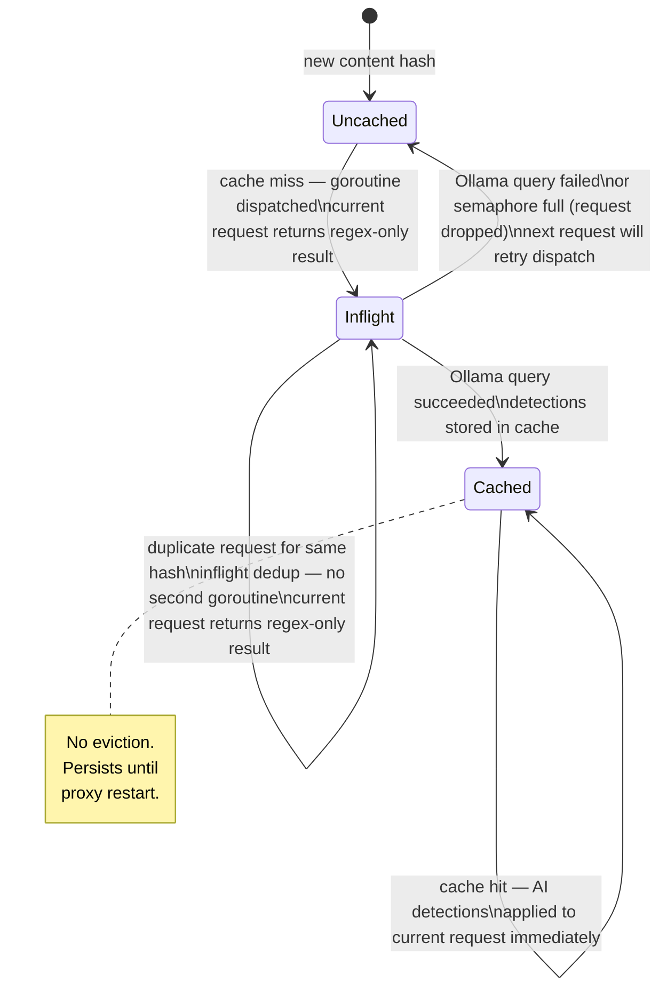
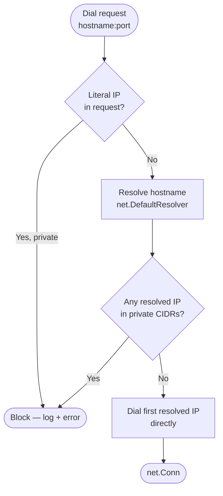
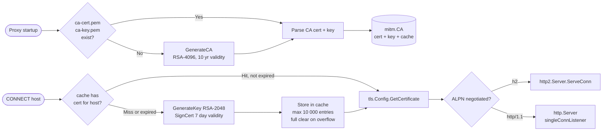
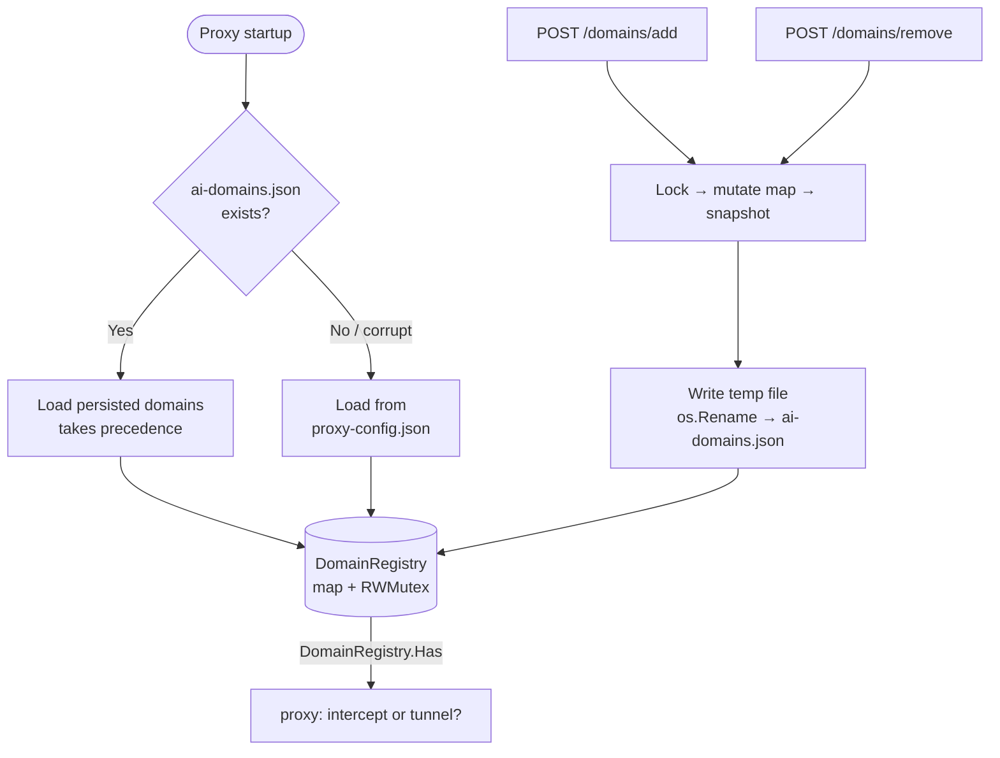

# Architecture

This document describes the internal design of the AI Anonymizing Proxy: how requests flow
through the system, how PII detection works, and the rationale behind key design choices.

## System overview

## Request lifecycle

### HTTPS CONNECT to an AI API domain (MITM path)

### HTTPS CONNECT to a non-AI domain (opaque tunnel)

### Plain HTTP to an AI API domain

## Anonymization pipeline

**Pattern confidence scores** determine whether Stage 2 triggers:

| PII type       | Example                         | Confidence |
|----------------|---------------------------------|------------|
| Email          | `user@example.com`              | 0.95       |
| API key        | `Bearer sk-abc…` (≥ 20 chars)   | 0.90       |
| SSN            | `123-45-6789`                   | 0.85       |
| Credit card    | `4111 1111 1111 1111`           | 0.85       |
| Street address | `123 Main Street`               | 0.75       |
| IP address     | `192.168.1.1`                   | 0.70       |
| Phone number   | `+1-555-123-4567`               | 0.65       |
| ZIP code       | `90210`                         | 0.40       |

All tokens are derived from `md5(original)[:8]` — deterministic, so the same value always
produces the same token within and across requests.

### Ollama cache states

Each content hash (md5 of the raw text) progresses through three states. The self-transition on
`Inflight` is the in-flight deduplication: a second request for the same content while Ollama is
still querying reuses the running goroutine rather than spawning a new one.

## De-anonymization and streaming

Each request gets a random `sessionID`. The token→original map is stored in
`anonymizer.sessions[sessionID]` during anonymization and deleted after the response is delivered.

For SSE (`Content-Type: text/event-stream`), `StreamingDeanonymize` wraps the response body in a
pipe-based reader that replaces tokens as data flows through, carrying a `maxTokenLen` (64 byte)
overlap window between chunks to prevent a token from being split across a read boundary.

## SSRF protection

Blocked CIDRs: `10.0.0.0/8`, `172.16.0.0/12`, `192.168.0.0/16`, `127.0.0.0/8`,
`169.254.0.0/16`, `::1/128`, `fc00::/7`, `fe80::/10`.

The check runs at dial time (not at request-parse time) to close the TOCTOU gap exploited by DNS
rebinding, where a hostname resolves to a public IP during the check but switches to a private IP
when the TCP connection is established.

## TLS / MITM cert lifecycle

## Domain registry and persistence

Writes use an atomic rename (write to a temp file, then `os.Rename`) so the persisted file is
never partially written. The `DomainRegistry` mutex is released before the write; `Has` calls
are never blocked by disk I/O.

## Packages

| Package               | Responsibility                                                              |
|-----------------------|-----------------------------------------------------------------------------|
| `cmd/proxy`           | Entry point: wires config, shared registry, metrics, both HTTP servers      |
| `internal/config`     | Layered config loading: defaults → `proxy-config.json` → env vars           |
| `internal/anonymizer` | Two-stage PII detection, token replacement, session maps, streaming de-anon |
| `internal/proxy`      | Request router: MITM tunnel, opaque tunnel, plain-HTTP forwarding, SSRF     |
| `internal/mitm`       | CA management, per-host leaf cert generation/caching, TLS handshake, ALPN   |
| `internal/management` | Management HTTP API + persistent `DomainRegistry`                           |
| `internal/metrics`    | Atomic request/error/token counters; latency stats; JSON snapshot           |
| `internal/logger`     | Structured, level-gated logger (debug/info/warn/error) → stderr             |

## Metrics architecture

All hot-path counters (`RequestsTotal`, `TokensReplaced`, etc.) are `sync/atomic.Int64` — no
mutex in the request path. Latency accumulators use one `sync.Mutex` each, updated once per
request at the call site. The `/metrics` endpoint produces a point-in-time JSON snapshot with
min/mean/max for anonymization and upstream round-trip latency.
