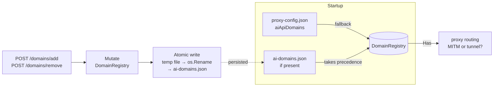

# Management API

The management API runs on port `8081` (configurable via `MANAGEMENT_PORT`) and binds to
`127.0.0.1` only — it is not exposed on external interfaces.

If `MANAGEMENT_TOKEN` is set, all requests require an `Authorization: Bearer <token>` header.
Domain names are validated against RFC 1123 hostname rules and normalised to lowercase. Request
bodies are capped at 1 KB.

> **Security note:** Set `MANAGEMENT_TOKEN` via an environment variable rather than storing it in
> `proxy-config.json`, as config files can be accidentally committed to version control.

## Endpoints

| Method | Path              | Description                          |
|--------|-------------------|--------------------------------------|
| GET    | `/status`         | Proxy health, uptime, domain list    |
| GET    | `/metrics`        | Runtime performance counters         |
| POST   | `/domains/add`    | Add an AI API domain at runtime      |
| POST   | `/domains/remove` | Remove an AI API domain at runtime   |

## Domain persistence

Runtime domain changes are written to disk atomically and restored on restart:



---

## GET /status

```bash
curl -H "Authorization: Bearer $TOKEN" http://localhost:8081/status
```

```json
{
  "status": "running",
  "uptime": "2m10s",
  "proxyPort": 8080,
  "aiApiDomains": ["api.anthropic.com", "api.openai.com", "..."],
  "ollama": {
    "endpoint": "http://localhost:11434",
    "model": "qwen2.5:3b",
    "enabled": true
  }
}
```

---

## GET /metrics

Returns live performance counters. Counters reset on proxy restart.

```bash
curl -H "Authorization: Bearer $TOKEN" http://localhost:8081/metrics
```

```json
{
  "requests": {
    "total": 142,
    "anonymized": 98,
    "passthrough": 38,
    "auth": 6
  },
  "errors": {
    "upstream": 1,
    "anonymize": 0
  },
  "piiTokens": {
    "replaced": 314,
    "deanonymized": 314
  },
  "latency": {
    "anonymizationMs": {
      "count": 98,
      "minMs": 0.4,
      "meanMs": 2.1,
      "maxMs": 18.7
    },
    "upstreamMs": {
      "count": 98,
      "minMs": 80.2,
      "meanMs": 320.5,
      "maxMs": 1840.3
    }
  },
  "uptimeSecs": 130.4
}
```

---

## POST /domains/add

Add an AI API domain at runtime. The change is persisted to `ai-domains.json` and survives
a proxy restart.

```bash
curl -X POST http://localhost:8081/domains/add \
  -H "Authorization: Bearer $TOKEN" \
  -H "Content-Type: application/json" \
  -d '{"domain":"api.newai.example.com"}'
```

Response:

```json
{"added": "api.newai.example.com"}
```

---

## POST /domains/remove

Remove an AI API domain at runtime. The change is persisted to `ai-domains.json`.

```bash
curl -X POST http://localhost:8081/domains/remove \
  -H "Authorization: Bearer $TOKEN" \
  -H "Content-Type: application/json" \
  -d '{"domain":"api.newai.example.com"}'
```

Response:

```json
{"removed": "api.newai.example.com"}
```
