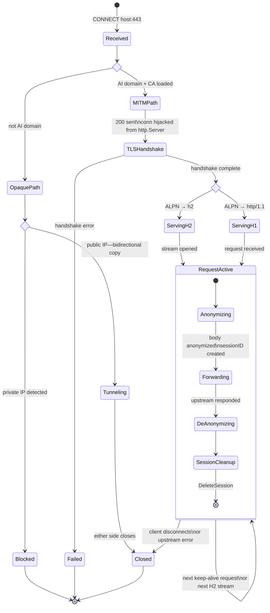

# HTTPS Interception (MITM TLS)

The proxy performs MITM TLS termination on HTTPS connections to AI API domains. It decrypts,
anonymizes PII in the request body, and re-encrypts before forwarding to the real API server.
Non-AI domains are tunneled transparently without inspection.

## How it works

```mermaid
sequenceDiagram
    participant C as Client (trusts proxy CA)
    participant P as Proxy
    participant CA as cert.go
    participant API as AI API (real TLS)

    C->>P: CONNECT api.openai.com:443
    P->>P: domain in aiApiDomains? → Yes
    P->>C: 200 Connection Established

    Note over C,P: TLS handshake begins
    C->>P: ClientHello
    P->>CA: CertFor("api.openai.com")
    CA-->>P: leaf cert signed by proxy CA
    P->>C: ServerHello (proxy-signed cert)
    Note over C,P: Client verifies cert against trusted proxy CA (ok)

    Note over P,API: Proxy opens its own TLS to the real API
    P->>API: TLS handshake (real api.openai.com cert)

    Note over C,P,API: Tunnel established — proxy sees plaintext
    C->>P: HTTP request (plaintext inside proxy TLS)
    P->>P: Anonymize PII in body
    P->>API: HTTP request (anonymized, inside real TLS)
    API-->>P: HTTP response
    P->>P: De-anonymize response
    P-->>C: HTTP response (original values restored)
```

**ALPN / protocol negotiation:**

The proxy advertises both `h2` and `http/1.1` during the TLS handshake. After the handshake,
`mitm.HandleConn` checks `NegotiatedProtocol` and routes to the appropriate server:

- `h2` → `golang.org/x/net/http2.Server.ServeConn`
- `http/1.1` (or empty) → `http.Server` wrapping a `singleConnListener`

## Connection states

State diagram for a single CONNECT request from arrival through to teardown. The `RequestActive`
self-transition captures the key behaviour: multiple requests share one hijacked connection
(HTTP/1.1 keep-alive or concurrent HTTP/2 streams) with a fresh session ID per request.



## CA certificate setup

On first start, the proxy **auto-generates** a CA certificate (`ca-cert.pem` / `ca-key.pem`) in
its working directory if the files don't exist.

**Auto-generate (default):** Just start the proxy. The CA files will be created and the log will
show platform-specific trust instructions.

**Manual generation:**

```bash
make gen-ca
```

**Bring your own CA:** Set `CA_CERT_FILE` and `CA_KEY_FILE` (or `caCertFile`/`caKeyFile` in
`proxy-config.json`) to point at your own PEM files. Useful for corporate PKI or a shared CA.

## Trusting the CA

Clients must trust the proxy's CA certificate. Without this, clients will reject the proxy's
certificates with TLS errors.

**macOS (system-wide, requires admin):**

```bash
sudo security add-trusted-cert -d -r trustRoot \
    -k /Library/Keychains/System.keychain /opt/ai-proxy/ca-cert.pem

# Or from the proxy directory:
cd /opt/ai-proxy && make import-ca-macos
```

**Linux (Debian/Ubuntu):**

```bash
sudo cp ca-cert.pem /usr/local/share/ca-certificates/ai-proxy-ca.crt
sudo update-ca-certificates

# Or use: make import-ca-linux
```

**Linux (RHEL/Fedora):**

```bash
sudo cp ca-cert.pem /etc/pki/ca-trust/source/anchors/ai-proxy-ca.crt
sudo update-ca-trust
```

**Windows (elevated Command Prompt):**

```cmd
certutil -addstore -f "ROOT" ca-cert.pem
```

**Node.js / npm:**

```bash
export NODE_EXTRA_CA_CERTS=/path/to/ca-cert.pem
```

Add to `~/.zshrc` / `~/.bashrc` to make it permanent:

```bash
export NODE_EXTRA_CA_CERTS=/opt/ai-proxy/ca-cert.pem
```

**Python (requests / pip):**

```bash
export REQUESTS_CA_BUNDLE=/path/to/ca-cert.pem
# or
export SSL_CERT_FILE=/path/to/ca-cert.pem
```

## Cert cache

The proxy caches one signed leaf certificate per hostname. Certificates are valid for 7 days and
regenerated transparently when they expire. The cache holds up to 10 000 entries; when that limit
is reached the entire cache is cleared (certs are cheap to regenerate, ~ms).

## Disabling MITM

To fall back to opaque TCP tunneling for all HTTPS traffic, set the CA paths to empty strings:

```bash
CA_CERT_FILE="" CA_KEY_FILE="" ./bin/proxy
```

Or in `proxy-config.json`:

```json
{
  "caCertFile": "",
  "caKeyFile": ""
}
```
